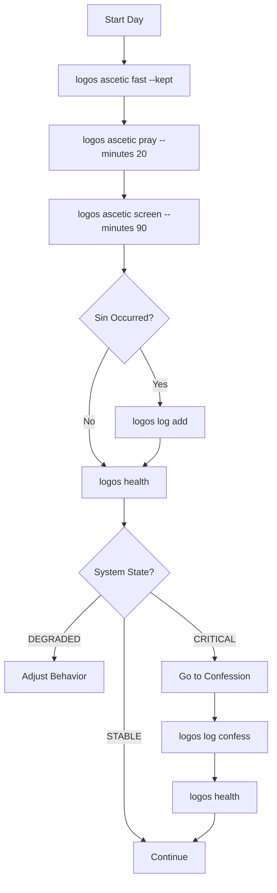

# Architecture

## Overview

LogOS is a CLI-first system for tracking ascetic practice and sin with fixed metaphysics.
It follows a strict separation between **observability** (reading truth) and **mutation** (recording action).

## Core Components

```
┌─────────────────────────────────────────────────────────────┐
│ CLI Layer (logos/cli.py)                                    │
│ - Argument parsing (argparse)                              │
│ - Command dispatcher                                        │
│ - Output formatting (systemctl style)                      │
└──────────────┬──────────────────────────────────────────────┘
               │
               ├──> Alignment (logos/alignment.py)
               │    └─ calculate_system_state()
               │       (FROZEN logic)
               │
               ├──> Mutations (logos/mutations.py)
               │    └─ log_hamartia, update_daily_state
               │       (Strict constraints)
               │
└──────────────┬──────────────────────────────────────────────┘
│ Database Layer (logos/db.py)                               │
│ - Explicit SQL queries                                     │
│ - No ORM                                                   │
│ - Loud failures on invariant violations                    │
└──────────────┬──────────────────────────────────────────────┘
               │
┌──────────────▼──────────────────────────────────────────────┐
│ PostgreSQL                                                  │
│ - hamartia_log (Append-only sin record)                     │
│ - daily_state (Today's ascetic state)                       │
│ - system_health_today (Read-only computed view)             │
│ - liturgical_calendar (Upstream truth)                      │
└─────────────────────────────────────────────────────────────┘
```

## Alignment Logic (Frozen)

The `calculate_system_state()` function (in `logos/alignment.py`) implements a fixed state machine. It is the core "Metaphysical Truth Engine".

### States

- **STABLE (0)**: All checks pass.
- **DEGRADED (1)**: Warning signs (e.g., missed prayer, high screen time ratio).
- **CRITICAL (2)**: Structural failures (e.g., too many unconfessed sins, vow violations).

### Checks

1.  **Hamartia Buffer Check (Memory Leak)**
    -   Condition: `unconfessed_count >= 5`
    -   Result: CRITICAL
    -   Why: Too much unresolved sin destabilizes the system.

2.  **Ascetic Integrity Check (Kernel Integrity)**
    -   Condition: Strict fast type AND not fasted
    -   Result: CRITICAL
    -   Why: Explicit vow violations are critical failures.
    -   Condition: Prayer not performed
        -   With sin: CRITICAL (compound failure)
        -   Without sin: DEGRADED (rule missed)

3.  **Signal/Noise Check (Latency)**
    -   Condition: Screen time > 0 AND (prayer + reading) / screen_time < 0.1
    -   Result: DEGRADED
    -   Why: Noise overwhelms signal.

## Write-Path Architecture

Mutations are strictly controlled. The "muscles" (write commands) are attached to the "nervous system" (observability) with specific constraints.

### Constraints

1.  **Append-Only Hamartia Log**
    -   `INSERT` is allowed.
    -   `DELETE` and `UPDATE` (of content) are FORBIDDEN.
    -   The only allowed update is marking `confessed = TRUE`.

2.  **Today-Only Mutations**
    -   `daily_state` can only be updated for `CURRENT_DATE`.
    -   No retroactive logging. The past is immutable.

3.  **Explicit Confession**
    -   Sins are only absolved via explicit `logos log confess` command.
    -   No auto-expiry or time decay.

### Data Flow



## Database Schema

### `hamartia_log` (Append-Only)
- `id`: Serial
- `date`: Date of sin
- `passions`: Category (e.g., Lust, Anger)
- `description`: Text
- `confessed`: Boolean (False by default)
- `confessed_at`: Timestamp (Null until confessed)

### `daily_state` (Mutable for Today)
- `date`: PK
- `prayer_minutes`, `reading_minutes`, `screen_time_minutes`: Integers
- `fasted`, `prayed`: Booleans

## Invariant Failures

The system fails loudly if upstream truth is missing. These are not silent defaults; they are hard stops to ensure the user is aware of system incompleteness.

- `error: no daily state found for today`
- `error: no liturgical context for today`
