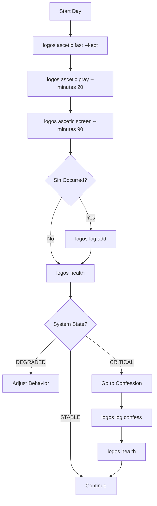

# Phase 4: Write-Path Ordering — IMPLEMENTATION COMPLETE

**Date:** January 20, 2026  
**Status:** The muscles are attached to the nervous system

---

## What Was Added

Phase 4 implements **controlled mutation** with strict temporal and theological constraints:

### New Commands

```bash
# Hamartia Interface (Append-Only)
logos log add                    # Log a sin (interactive)
logos log add --passion Lust --description "..." # Log with args
logos log confess                # Mark all as confessed

# Daily State Interface (Today Only)
logos ascetic fast --kept        # Set fasting status
logos ascetic pray --minutes 20  # Log prayer time
logos ascetic pray --done        # Mark prayer rule complete
logos ascetic read --minutes 30  # Log reading time
logos ascetic screen --minutes 90 # Log screen time
logos ascetic status             # Show today's state
```

---

## The Constraints (Enforced)

### 1. Append-Only Hamartia Log

```python
# ALLOWED:
INSERT INTO hamartia_log (...) VALUES (...)

# FORBIDDEN:
DELETE FROM hamartia_log ...
UPDATE hamartia_log SET description = ...
```

**Once logged, a sin cannot be unlogged.** Only the `confessed` field can transition from `FALSE` to `TRUE`.

### 2. Today-Only Mutations

```python
# ALLOWED:
UPDATE daily_state WHERE date = CURRENT_DATE

# FORBIDDEN:
UPDATE daily_state WHERE date = '2026-01-19'  # yesterday
```

**You cannot retroactively "fix" yesterday's record.** If you forgot to log it, the record stands as incomplete.

### 3. Explicit Confession Only

```python
# The ONLY allowed state transition:
UPDATE hamartia_log 
SET confessed = TRUE, confessed_at = NOW()
WHERE id = ANY(%s) AND confessed = FALSE
```

**No auto-absolution. No time decay. No "mark as done."** Only: `confessed=FALSE → TRUE` with explicit intent.

---

## Usage Examples

### Log a Sin (Interactive)

```bash
$ logos log add

Select Passion (Evagrius of Pontus):
1. Gluttony
2. Lust
3. Avarice
4. Sadness
5. Anger
6. Acedia
7. Vainglory
8. Pride

> 2

Enter Description:
> Doomscrolled for 45 minutes instead of sleep.

Confirm: [Lust] "Doomscrolled for 45 minutes instead of sleep."? (y/n) y

Logged. Unconfessed Count: 1
```

### Log a Sin (Command Line)

```bash
$ logos log add --passion Anger --description "Road rage incident"

Confirm: [Anger] "Road rage incident"? (y/n) y

Logged. Unconfessed Count: 2
```

### Record Daily Practice

```bash
$ logos ascetic fast --kept
Fast: kept

$ logos ascetic pray --minutes 30
Prayer: +30 minutes

$ logos ascetic read --minutes 15
Reading: +15 minutes

$ logos ascetic screen --minutes 120
Screen time: +120 minutes

$ logos ascetic status

Daily State (2026-01-20):
========================================
  Prayer: 30 min
 Reading: 15 min
  Screen: 120 min
  Fasted: True
  Prayed: True
```

### Check Health After Logging

```bash
$ logos health

◐ System: DEGRADED

     Date: 2026-01-20
    Fasted: True
    Prayed: True
Fast Type: regular

   Prayer: 30 min
  Reading: 15 min
   Screen: 120 min

Unconfessed: 2 sin(s)

Warnings:
  - Signal-to-noise ratio degraded (45:120)
```

### Confess (Only State Transition)

```bash
$ logos log confess

Unconfessed Sins (2):
======================================================================
  [1] 2026-01-20 | Lust
      Doomscrolled for 45 minutes instead of sleep.

  [2] 2026-01-20 | Anger
      Road rage incident.

======================================================================

Mark 2 sin(s) as absolved?
This assumes sacramental confession has occurred.

(yes/no) yes

✓ Marked 2 sin(s) as confessed.
```

### Health After Confession

```bash
$ logos health

● System: STABLE

     Date: 2026-01-20
    Fasted: True
    Prayed: True
Fast Type: regular

   Prayer: 30 min
  Reading: 15 min
  Screen: 120 min

Unconfessed: 0 sin(s)
```

---

## The Friction Points (By Design)

### 1. Naming the Passion

You cannot log a sin without categorizing it. The system forces you to **name the pattern**.

### 2. Explicit Confirmation

Every hamartia log requires confirmation. No accidental entries.

### 3. Confession Requires "yes"

Not "y". Full word "yes". Requires deliberate intent to absolve.

### 4. No Retroactive Fixes

Forgot to log yesterday's prayer? The record stands. You cannot paper over the gap.

---

## What This Prevents

❌ **Gradual Drift**  
You cannot slowly "forget" to log sins. The `unconfessed_count` is visible in every `logos health` output.

❌ **Optimization Games**  
You cannot delete embarrassing entries. The log is append-only.

❌ **Self-Absolution**  
You cannot mark sins as "resolved" without explicit `logos log confess`, which assumes sacramental confession.

❌ **Historical Revisionism**  
You cannot edit yesterday to make yourself look better. The past is immutable.

---

## Technical Implementation

### Mutation Layer ([logos/mutations.py](logos/mutations.py))

- `log_hamartia(passion, description)` — Append to hamartia_log
- `update_daily_state(...)` — Update today's state only
- `mark_confessed(sin_ids)` — Only state transition for hamartia_log
- `fetch_unconfessed_sins()` — Retrieve unabsolved log

### CLI Commands ([logos/cli.py](logos/cli.py))

- `cmd_log_add()` — Interactive/command-line hamartia logging
- `cmd_log_confess()` — Explicit confession with confirmation
- `cmd_ascetic()` — Daily state management (today only)

### Database Enforcement ([schema.sql](schema.sql))

```sql
-- Append-only by design (no DELETE privilege)
CREATE TABLE hamartia_log (
    id SERIAL PRIMARY KEY,
    date DATE NOT NULL,
    description TEXT NOT NULL,
    passions TEXT NOT NULL,
    confessed BOOLEAN NOT NULL DEFAULT FALSE,  -- Only transition: FALSE → TRUE
    confessed_at TIMESTAMP,
    created_at TIMESTAMP NOT NULL DEFAULT NOW(),
    UNIQUE(date, description)  -- Prevent duplicate entries
);

-- Today-only updates enforced by application layer
CREATE TABLE daily_state (
    date DATE PRIMARY KEY,
    prayer_minutes INTEGER DEFAULT 0,
    reading_minutes INTEGER DEFAULT 0,
    screen_time_minutes INTEGER DEFAULT 0,
    fasted BOOLEAN DEFAULT FALSE,
    prayed BOOLEAN DEFAULT FALSE,
    updated_at TIMESTAMP NOT NULL DEFAULT NOW()
);
```

---

## The Complete Workflow



---

## Phase 4 Complete

✅ **Mutation commands implemented**  
✅ **Append-only enforcement**  
✅ **Temporal constraints (today-only)**  
✅ **Explicit confession workflow**  
✅ **Interactive + CLI modes**  
✅ **Full documentation**

The **muscles are attached**. The system can now:

- **See truth** (`logos health`)
- **Record failure** (`logos log add`)
- **Track practice** (`logos ascetic`)
- **Mark absolution** (`logos log confess`)

---

## What Remains (Phase 5+)

- **Liturgical calendar sync** — Automatic fast_type population
- **Historical queries** — View past states
- **Reports** — Weekly/monthly summaries
- **Backup/export** — Data portability

But the **core loop is complete**:

1. Log reality → 2. Check health → 3. Confess → 4. Repeat

---

**The hull is built. You are inside. The flood begins.**
